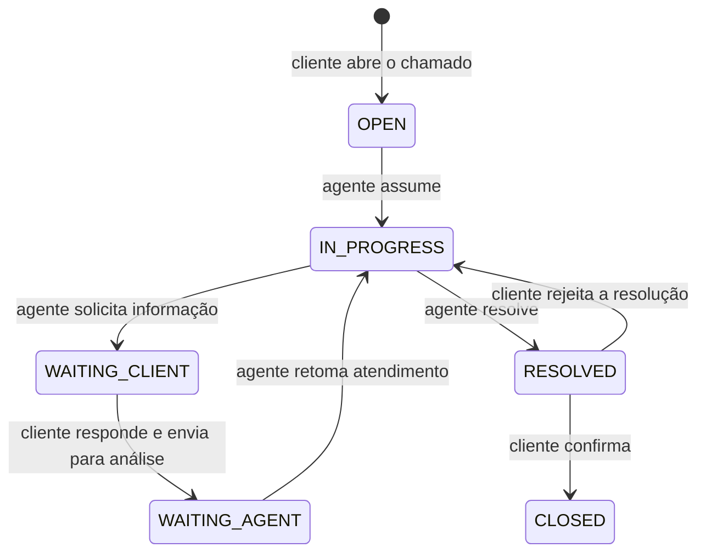
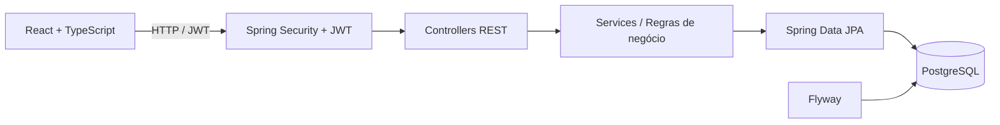

<div align="center">

# Helpdesk

**Sistema full stack de gerenciamento de chamados de suporte, com fluxos específicos para clientes, agentes e administradores.**


</div>

## Sobre o projeto

O **Helpdesk** simula a operação de uma central de suporte: clientes abrem e acompanham chamados, agentes trabalham em filas operacionais e administradores supervisionam usuários, distribuição de trabalho e indicadores.

O foco do projeto não é apenas CRUD. A aplicação implementa **regras de transição de status, autorização por perfil, atribuição concorrente de chamados, histórico auditável, comentários internos, dashboards por papel e gestão administrativa de agentes**.

### Preview - Dashboard de Administrador


<details>
<summary><strong>Ver mais telas</strong></summary>
<br />

**Detalhes do chamado**


**Filas de Atendimento de Agente**


**Tela Home de Cliente**


</details>

## Funcionalidades

| Perfil | Principais recursos |
| --- | --- |
| **CLIENT** | Cadastro e login, abertura de chamados, filtros e paginação dos próprios chamados, comentários, acompanhamento do histórico, envio para nova análise, confirmação ou rejeição da resolução e gerenciamento da própria conta. |
| **AGENT** | Visualização de chamados acessíveis, filas operacionais, atribuição de chamado, comentários públicos e internos, transições controladas de status, dashboard individual e métricas de desempenho por período. |
| **ADMIN** | Supervisão global dos chamados, dashboard administrativo, filtros por agente, transferência/devolução de chamados, gestão de roles, bloqueio/desbloqueio de usuários e redistribuição de chamados ativos. |

### Destaques técnicos

- **Atribuição atômica de chamados:** a operação de assumir um chamado usa atualização condicional no banco para impedir que dois agentes assumam o mesmo ticket simultaneamente.
- **Fluxo de status controlado:** cada papel só pode executar transições válidas para o momento atual do atendimento.
- **Autorização além da interface:** as regras de acesso são aplicadas no backend com Spring Security e validações de domínio.
- **Histórico auditável:** criação, mudanças de status, atribuições, transferências, devoluções e rejeições de resolução são registradas no histórico.
- **Comentários internos:** mensagens privadas ficam disponíveis para a equipe de suporte, mas não são expostas ao cliente.
- **Gestão segura de agentes:** um agente com chamados ativos não pode simplesmente perder a função ou ser bloqueado sem que seus chamados sejam tratados.
- **Proteções de autenticação:** JWT stateless, senhas com BCrypt e rate limiting nos endpoints públicos de login e cadastro.
- **Experiência por perfil:** cliente, agente e administrador possuem navegação e dashboards diferentes; a interface também oferece tema claro/escuro e estados de loading/erro.

## Fluxo de um chamado



## Arquitetura



O backend segue uma arquitetura em camadas, separando **controllers, services, repositories, entidades/DTOs e segurança**. No frontend, o código é organizado por **features**, com React Query para estado assíncrono, Zustand para autenticação/estado global e React Hook Form + Zod para formulários e validação.

## Stack

| Backend | Frontend | Infraestrutura e qualidade |
| --- | --- | --- |
| Java 21 | React 19 | PostgreSQL 16 |
| Spring Boot 3.5 | TypeScript 6 | Docker / Docker Compose |
| Spring Security | Vite 8 | Flyway |
| Spring Data JPA / Hibernate | Tailwind CSS 4 | GitHub Actions |
| JWT (JJWT) | React Query | JUnit 5 / Mockito |
| Bean Validation | Zustand | Testcontainers |
| OpenAPI / Swagger | React Hook Form + Zod | Vitest / Testing Library |

## Como executar

### Opção recomendada — Docker Compose

**Pré-requisito:** Docker com Docker Compose.

1. Na raiz do repositório, crie o arquivo de ambiente:

```bash
# Linux/macOS/Git Bash
cp .env.example .env

# PowerShell
# Copy-Item .env.example .env
```

2. Ajuste o `.env` com valores locais. O `JWT_SECRET` deve possuir pelo menos 32 caracteres:

```env
POSTGRES_DB=helpdesk_db
POSTGRES_USER=helpdesk_user
POSTGRES_PASSWORD=helpdesk_pass
JWT_SECRET=helpdesk-dev-secret-change-this-key-32-chars-minimum
```

3. Suba a aplicação:

```bash
docker compose up --build
```

Após a inicialização:

- **Frontend:** http://localhost:3000
- **API:** http://localhost:8080/api
- **Swagger UI:** http://localhost:8080/swagger-ui/index.html

### Conta administrativa de demonstração

A migration cria uma conta administrativa apenas para facilitar a avaliação local do projeto:

| E-mail | Senha |
| --- | --- |
| `admin@helpdesk.local` | `admin@123` |

Novos cadastros públicos são criados como `CLIENT`. Para testar o fluxo de `AGENT`, cadastre uma segunda conta e altere sua role pelo painel administrativo.

> **Nota:** a conta acima é intencionalmente uma credencial de demonstração para ambiente local/portfólio; não representa uma estratégia adequada para produção.

### Dados de demonstração opcionais

Com a aplicação iniciada, é possível popular o banco com um conjunto determinístico de dados fictícios:

```bash
docker compose --profile demo run --rm demo-seed
```

A seed cria 5 agentes, 20 clientes, 100 chamados e seus comentários e históricos. Os chamados cobrem diferentes prioridades, responsáveis, datas e estados para preencher filas, filtros e dashboards. Executar o comando novamente substitui apenas os chamados dos clientes demo, sem duplicá-los.

Todas as contas criadas pela seed utilizam a senha `admin@123`. Alguns exemplos:

| Perfil | E-mail |
| --- | --- |
| Agente | `agente.01.demo@helpdesk.local` |
| Cliente | `cliente.01.demo@helpdesk.local` |

Os agentes vão de `agente.01` a `agente.05` e os clientes de `cliente.01` a `cliente.20`, sempre com o sufixo `.demo@helpdesk.local`.

Para remover somente os dados de demonstração:

```bash
docker compose --profile demo run --rm demo-clear
```

Se um agente demo tiver sido atribuído manualmente ao chamado de uma conta comum, a limpeza será interrompida para não modificar esse chamado.

## Testes e CI

### Backend

```bash
cd backend
./mvnw clean verify
```

A suíte inclui testes de services, autenticação/autorização, tratamento de erros e um teste de integração com **Testcontainers** para validar a concorrência na atribuição de chamados.

### Frontend

```bash
cd frontend
npm ci
npm run lint
npm test
npm run build
```

O workflow do **GitHub Actions** executa automaticamente o `clean verify` do backend e `lint + test + build` do frontend em pull requests para `develop` e `main`.

## Estrutura do repositório

```text
helpdesk/
├── .github/
│   └── workflows/
│       └── ci.yml
├── backend/
│   ├── src/main/java/.../
│   │   ├── config/
│   │   ├── controller/
│   │   ├── dto/
│   │   ├── entity/
│   │   ├── exception/
│   │   ├── repository/
│   │   ├── security/
│   │   └── service/
│   └── src/main/resources/db/migration/
├── frontend/
│   └── src/
│       ├── app/
│       ├── features/
│       ├── layouts/
│       ├── pages/
│       └── shared/
├── docker-compose.yml
└── .env.example
```

## API e documentação

Com o backend em execução, a especificação OpenAPI pode ser explorada pelo **Swagger UI** em:

```text
http://localhost:8080/swagger-ui/index.html
```

A documentação descreve os endpoints de autenticação, conta, chamados, comentários, histórico, filas, dashboards e administração de usuários, incluindo as restrições de acesso por perfil.

## Objetivo do projeto

Este projeto foi desenvolvido como **projeto de portfólio e aprendizado**, com foco em práticas que aparecem em sistemas reais: modelagem de regras de negócio, segurança, concorrência, tratamento de erros, testes automatizados, migrations, organização de código e integração entre frontend e backend.
